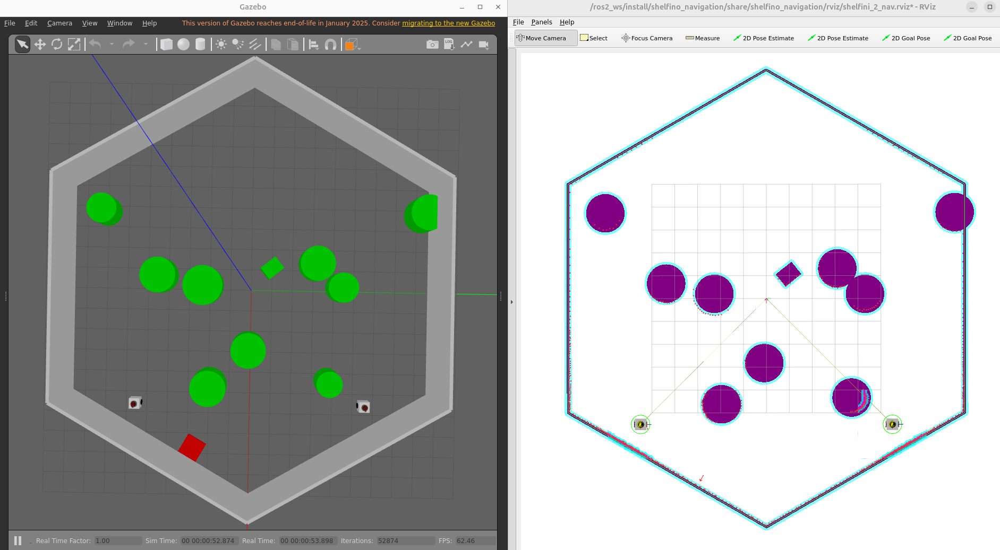

# Course Project: Robot Planning and Application- AY 2024/2025

## Project Overview
Designed for static environments involving to develop a path planning algorithm to move the robot.
This project combines theoretical knowledge with practical implementation, focusing on algorithms such as Probabilistich Random Map and Combinatorial planning to find the optimal path for a robot in a random environments.

User can select different algorithms to see how they perform in various scenarios. It's just launch the different launch files and run the service to send the path planning request.

This Demo Video shows the project in action: [Demo Video]().

## Technologies Used

- **Robot**: Shelfino of the University of Trento
- **Programming Languages**: C++ (core ROS 2 nodes), Python (to launch the nodes)
- **Robotic Framework**:  [ROS 2](https://docs.ros.org/en/humble/index.html)
- **Simulation Environment**: [Gazebo](https://gazebosim.org/docs/latest/ros2_integration/)
- **Motion Planning**: [NAV2](https://docs.nav2.org/) (only to send the commands to the robot)
- **Task Planning**: Custom ROS 2 nodes
- **Other features**: Use a radiocommand to start/stop the robot  
- **Docker user:** YES
- **CI/CD-GithubAction:** YES (only colcon build action)
- **Radiocommand**: [RadioMaster pocket](https://radiomasterrc.com/collections/pocket-radio) with [OpenTX](https://www.open-tx.org/) firmware


## Simulation Scene

The simulation scene includes the following key components:

- 2 shelfino robots, that spawn in a random position in the map
- A static environment with obstacles (can be Rectangles or circles obstacles) and walls 
- Differente shape of the map (exagon, square)
- Rviz2 for visualizing the robot's path and environment and other useful information




## Installation Guide

This guide explains how to set up the project on your local machin, using docker.

>Note: docker use 6 GB

If you prefer you can see this video tutorial: [Video Tutorial]() to install and setup the project, or you can follow the steps below:

1. **Prerequisites**: Ensure you have Docker and Docker Compose installed on your machine. You can download them from the following links:
   - [Docker Installation Guide](https://docs.docker.com/get-docker/)
   - [Docker Compose Installation Guide](https://docs.docker.com/compose/install/)

2. **Clone the Repository**: Start by cloning the project repository to your local machine.

   ```bash
   git clone <repository_url>
   cd <repository_directory>
   ```

3. **Build the Docker Image**: Use the provided Dockerfile to build the Docker image.

   ```bash
   docker build -t robot_planning_app .
   ```

4. **Run the Docker Container**: Use Docker Compose to run the container with the necessary configurations.

   ```bash 
    docker-compose up
    ```
5. **compile the project**: inside the docker container, navigate to the src directory and run colcon build

   ```bash
   cd ~/ros2_ws
   colcon build --symlink-install
   source install/setup.bash
   ```
6. **Launch the Simulation**: Use the provided launch files to start the simulation environment.

   ```bash
   ros2 launch <launch_file_name>.launch.py
   ```

7. **Launch the planning algorithm**:

   ```bash
   ros2 launch <planning_algorithm_launch_file>.launch.py
   ``` 
8. **Send Path Planning Requests**: Use the provided service to send path planning requests to the robot.

   ```bash
   ros2 service call /<service_name> <service_type> "{<request_parameters>}"
   ```


## Run and test

when you clone/download the repo, to run the simulation and test the path planning algorithms, follow these steps:

This Demo Video shows the project in action: [Demo Video]().


## Project Structure

```
workspace/
    ├── planning_pkg                --> package that contains the path planning part
    |   ├── launch                  --> folder that contains the launch files
    |   ├──src                      --> folder that contains the source code
    |   |    ├──algo_path_planning  --> folder that contains the path planning algorithms
    |   |    ├──utils               --> folder that contains utility functions
    |   |    └──path_orchestrator_xxx.cpp  --> main node that orchestrates the path planning
    |   └──include                  --> folder that contains the header files
    ├── projects                    --> package that contains the launch file to launch the project  
    ...

```


## Link of the Report

If you want interest to see the report of the project, you can find it here: [Report Link]() 

Enjoy the project! :D